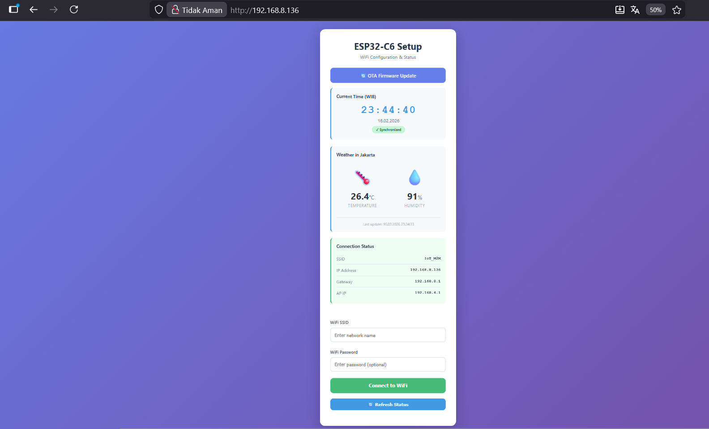
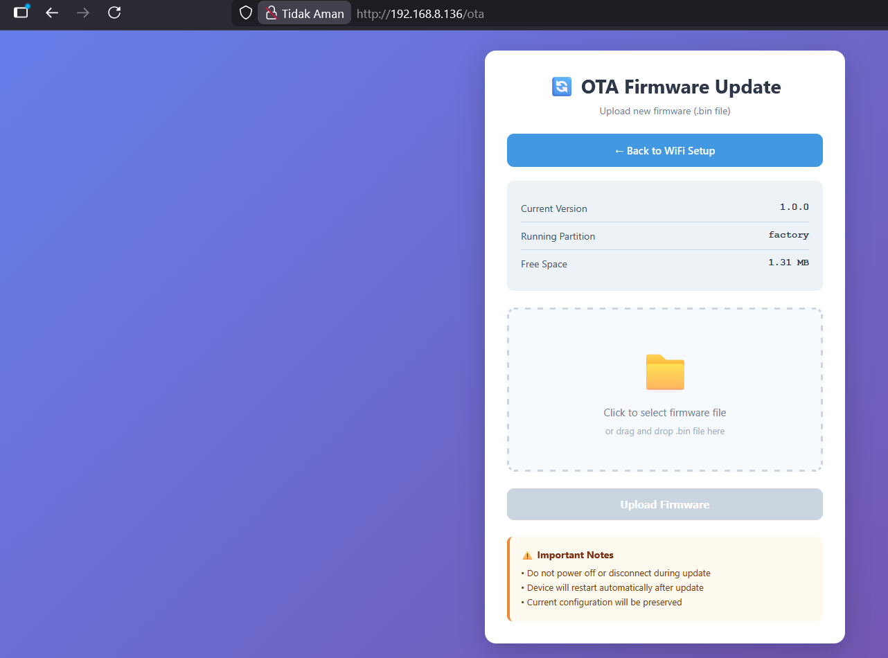

# ESP32-C6 OTA Weather Station


A complete IoT weather station with OTA firmware updates, WiFi provisioning, and real-time weather monitoring for Jakarta, Indonesia.



---

## 🌟 Features

### Core Functionality
- 🌐 **WiFi Provisioning** - Easy WiFi configuration via web interface (AP mode)
- 🔄 **OTA Firmware Updates** - Secure over-the-air updates with dual partition system
- ⏰ **Real-Time Clock** - NTP synchronization with WIB (GMT+7) timezone
- 🌦️ **Weather Monitoring** - Live temperature & humidity data from Open-Meteo API
- 💡 **LED Indicators** - Visual status feedback for system operations
- 📱 **Responsive Web UI** - Beautiful gradient design, mobile-friendly

### Technical Features
- **Dual Partition OTA** - Safe firmware updates with automatic rollback
- **Factory Recovery** - Fallback partition for system recovery
- **APSTA Mode** - Simultaneous AP and Station mode operation
- **HTTPS Support** - Secure API communication with certificate validation
- **JSON REST APIs** - Easy integration with external systems

---

## 📋 Table of Contents

- [Hardware Requirements](#hardware-requirements)
- [Software Requirements](#software-requirements)
- [Quick Start](#quick-start)
- [Project Structure](#project-structure)
- [Web Interface](#web-interface)
- [API Documentation](#api-documentation)
- [LED Indicators](#led-indicators)
- [Configuration](#configuration)
- [OTA Update Process](#ota-update-process)
- [Troubleshooting](#troubleshooting)
- [Architecture](#architecture)
- [Contributing](#contributing)
- [License](#license)

---

## 🔧 Hardware Requirements

- **ESP32-C6 Development Board** (any variant with 4MB flash)
- **3x LEDs** (any color, with appropriate resistors)
- **Breadboard & Jumper Wires**
- **USB-C Cable** for programming

### Wiring Diagram
```
ESP32-C6          LED
GPIO 4  ────────  System Status LED (WiFi/OTA/Recovery)
GPIO 5  ────────  Weather Fetch LED
GPIO 6  ────────  AP Mode LED
GND     ────────  LED Common Cathode (via resistors)
```

**Recommended resistors:** 220Ω - 330Ω per LED

---

## 💻 Software Requirements

- **ESP-IDF v5.4+** ([Installation Guide](https://docs.espressif.com/projects/esp-idf/en/latest/esp32c6/get-started/))
- **Python 3.8+**
- **Git**

### ESP-IDF Setup
```bash
# Install ESP-IDF
git clone -b v5.4 --recursive https://github.com/espressif/esp-idf.git
cd esp-idf
./install.sh esp32c6
python -m venv venv
.\venv\Scripts\activate
# Activate environment
. ./export.sh
```

---

## 🚀 Quick Start

### 1. Clone Repository
```bash
git clone https://github.com/yourusername/esp32c6-ota-weather.git
cd esp32c6-ota-weather
```

### 2. Configure Project
```bash
# Set target
idf.py set-target esp32c6

# (Optional) Configure menuconfig
idf.py menuconfig
```

### 3. Build & Flash
```bash
# Build project
idf.py build

#clean up
idf.py fullclean

# Flash to device
 python -m esptool --chip esp32c6 -b 460800 --before default_reset --after hard_reset write_flash --flash_mode dio --flash_size 4MB --flash_freq 80m 0x0 build/bootloader/bootloader.bin 0x8000 build/partition_table/partition-table.bin 0x10000 build/esp32c6-ota-weather.bin

#erase memory
python -m esptool --chip esp32c6 --port COM5 erase_flash

#monitor
python -m serial.tools.miniterm "COM5" 115200
```

### 4. First Time Setup

1. **Connect to AP:**
   - SSID: `ESP32-C6-Setup`
   - Password: `12345678`

2. **Open Browser:**
   - Navigate to: `http://192.168.4.1`

3. **Configure WiFi:**
   - Enter your WiFi credentials
   - Click "Connect to WiFi"
   - Device will restart and connect

4. **Access Dashboard:**
   - Find device IP in serial monitor
   - Open `http://[DEVICE-IP]/` in browser

---

## 📁 Project Structure
```
esp32c6-ota-weather/
├── CMakeLists.txt              # Root CMake configuration
├── sdkconfig.defaults          # Default project configuration
├── partitions.csv              # Partition table (Factory + OTA)
├── README.md                   # This file
├── docs/
│   └── architecture.md         # Architecture documentation
├── components/
│   ├── led_indicator/          # LED control component
│   │   ├── led_indicator.c
│   │   ├── include/led_indicator.h
│   │   └── CMakeLists.txt
│   ├── wifi_manager/           # WiFi connection management
│   │   ├── wifi_manager.c
│   │   ├── include/wifi_manager.h
│   │   └── CMakeLists.txt
│   ├── sntp_sync/              # NTP time synchronization
│   │   ├── sntp_sync.c
│   │   ├── include/sntp_sync.h
│   │   └── CMakeLists.txt
│   ├── ota_manager/            # OTA update logic
│   │   ├── ota_manager.c
│   │   ├── include/ota_manager.h
│   │   └── CMakeLists.txt
│   ├── weather_client/         # Weather API client
│   │   ├── weather_client.c
│   │   ├── include/weather_client.h
│   │   └── CMakeLists.txt
│   └── web_server/             # HTTP server & web UI
│       ├── web_server.c
│       ├── include/web_server.h
│       └── CMakeLists.txt
└── main/
    ├── main.c                  # Main application
    └── CMakeLists.txt
```

---

## 🌐 Web Interface

### Main Dashboard

Access at: `http://[DEVICE-IP]/`

**Features:**
- ✅ Current time display (WIB timezone)
- ✅ Weather information (Temperature & Humidity)
- ✅ WiFi connection status
- ✅ Network information (IP, Gateway)
- ✅ WiFi reconfiguration form
- ✅ Link to OTA update page

### OTA Update Page

Access at: `http://[DEVICE-IP]/ota`

**Features:**
- 📤 Drag & drop firmware upload
- 📊 Real-time upload progress
- ℹ️ Current firmware version & partition info
- ⚠️ Safety warnings

---

## 🔌 API Documentation

### Base URL
```
http://[DEVICE-IP]/api
```

### Endpoints

#### 1. Get System Status
```http
GET /api/status
```

**Response:**
```json
{
  "connected": true,
  "ssid": "IoT_M2M",
  "ip": "192.168.8.136",
  "subnet": "255.255.255.0",
  "gateway": "192.168.8.1",
  "ap_ip": "192.168.4.1"
}
```

#### 2. Get Current Time
```http
GET /api/time
```

**Response:**
```json
{
  "synced": true,
  "time": "16.02.2026 23:45:30",
  "year": 2026,
  "month": 2,
  "day": 16,
  "hour": 23,
  "minute": 45,
  "second": 30,
  "epoch": 1771259130
}
```

#### 3. Get Weather Data
```http
GET /api/weather
```

**Response:**
```json
{
  "valid": true,
  "temperature": 26.4,
  "humidity": 91,
  "last_update": 1771259073,
  "last_update_str": "16.02.2026 23:34:33"
}
```

#### 4. Save WiFi Configuration
```http
POST /api/wifi/save
Content-Type: application/json

{
  "ssid": "MyWiFi",
  "password": "mypassword"
}
```

**Response:**
```json
{
  "success": true
}
```

#### 5. Get OTA Info
```http
GET /api/ota/info
```

**Response:**
```json
{
  "version": "1.0.0",
  "partition": "ota_0",
  "free_space": 1376256
}
```

#### 6. Upload Firmware
```http
POST /api/ota/update
Content-Type: multipart/form-data

file: [binary .bin file]
```

**Response:**
```json
{
  "success": true
}
```

---

## 💡 LED Indicators

### GPIO 4 - System Status LED

| Pattern | Meaning |
|---------|---------|
| **Solid ON** | WiFi connected (normal operation) |
| **Blink 200ms** | OTA update in progress |
| **Blink 1000ms** | Recovery mode / System error |
| **OFF** | WiFi disconnected |

### GPIO 5 - Weather Fetch LED

| Pattern | Meaning |
|---------|---------|
| **Blink** | Fetching weather data from API |
| **ON (2 seconds)** | Fetch completed successfully |
| **OFF** | Idle |

### GPIO 6 - AP Mode LED

| Pattern | Meaning |
|---------|---------|
| **Solid ON** | AP mode active (provisioning available) |
| **OFF** | STA mode only |

---

## ⚙️ Configuration

### WiFi Settings

Default AP credentials (change in `wifi_manager.h`):
```c
#define WIFI_AP_SSID        "ESP32-C6-Setup"
#define WIFI_AP_PASSWORD    "12345678"
#define WIFI_AP_IP          "192.168.4.1"
```

### Weather Settings

Location (change in `weather_client.h`):
```c
#define WEATHER_LATITUDE    "-6.1818"
#define WEATHER_LONGITUDE   "106.8223"
#define WEATHER_FETCH_INTERVAL_MS   (3600000)  // 1 hour
```

### Firmware Version

Update in `ota_manager.h`:
```c
#define FIRMWARE_VERSION "1.0.0"
```

### Partition Table

Edit `partitions.csv` for custom partition sizes:
```csv
factory,  app,  factory, 0x10000, 0x150000,  # 1.31 MB
ota_0,    app,  ota_0,   ,        0x150000,  # 1.31 MB
ota_1,    app,  ota_1,   ,        0x150000,  # 1.31 MB
```

---

## 🔄 OTA Update Process

### Method 1: Via Web Interface (Recommended)

1. Build new firmware:
```bash
   idf.py build
```

2. Locate binary:
```
   build/esp32c6-ota-weather.bin
```

3. Open OTA page:
```
   http://[DEVICE-IP]/ota
```

4. Upload `.bin` file

5. Wait for upload & verification

6. Device reboots automatically

### Method 2: Via Command Line
```bash
# Using curl
curl -X POST http://[DEVICE-IP]/api/ota/update \
  -F "file=@build/esp32c6-ota-weather.bin"
```

### Rollback Protection

- Dual partition system (ota_0 ↔ ota_1)
- Automatic rollback on boot failure
- Factory partition as last resort recovery

---

## 🐛 Troubleshooting

### Device not showing AP mode

**Solution:**
- Press reset button
- Check LED 6 (should be ON in AP mode)
- Look for `ESP32-C6-Setup` in WiFi networks

### Cannot connect to WiFi

**Solution:**
- Check SSID & password are correct
- Ensure 2.4GHz network (ESP32 doesn't support 5GHz)
- Check router allows new devices
- View serial logs: `idf.py monitor`

### Weather data shows "unavailable"

**Solution:**
- Check internet connection
- Verify time is synchronized (NTP)
- Check API endpoint in logs
- Certificate bundle may need updating

### OTA update fails

**Solution:**
- Ensure `.bin` file is correct firmware
- Check file size < partition size (1.31 MB)
- Verify WiFi connection is stable
- Check serial logs for error details

### Time not synchronizing

**Solution:**
- Check WiFi internet access
- Verify NTP server is reachable
- Wait up to 30 seconds for first sync
- Check firewall allows NTP (UDP port 123)

---

## 🏗️ Architecture

See detailed architecture documentation: [docs/architecture.md](docs/architecture.md)

**High-level overview:**
```
┌─────────────────────────────────────────────────────┐
│                   Web Browser                        │
│          (Dashboard & OTA Interface)                 │
└──────────────────┬──────────────────────────────────┘
                   │ HTTP/HTTPS
                   ↓
┌─────────────────────────────────────────────────────┐
│                 Web Server Component                 │
│  (HTML Rendering, REST API Endpoints, Handlers)     │
└──┬────────┬─────────┬──────────┬────────────────┬───┘
   │        │         │          │                │
   ↓        ↓         ↓          ↓                ↓
┌──────┐ ┌────────┐ ┌──────┐ ┌──────────┐ ┌──────────┐
│ WiFi │ │  SNTP  │ │ OTA  │ │ Weather  │ │   LED    │
│ Mgr  │ │  Sync  │ │ Mgr  │ │  Client  │ │Indicator │
└──────┘ └────────┘ └──────┘ └──────────┘ └──────────┘
```

---

## 🤝 Contributing

Contributions are welcome! Please follow these steps:

1. Fork the repository
2. Create feature branch (`git checkout -b feature/AmazingFeature`)
3. Commit changes (`git commit -m 'Add some AmazingFeature'`)
4. Push to branch (`git push origin feature/AmazingFeature`)
5. Open a Pull Request

---

## 📝 License

This project is licensed under the MIT License - see the [LICENSE](LICENSE) file for details.

---

## 🙏 Acknowledgments

- **Espressif Systems** - ESP-IDF framework
- **Open-Meteo** - Free weather API
- **Community contributors** - Bug reports and feature requests

---


**Made with ❤️ using ESP32-C6 by MJ Mokhtar**