# Architecture Documentation

ESP32-C6 OTA Weather Station - Technical Architecture

---

## Table of Contents

- [System Overview](#system-overview)
- [Component Architecture](#component-architecture)
- [Data Flow](#data-flow)
- [Sequence Diagrams](#sequence-diagrams)
- [Memory Layout](#memory-layout)
- [Communication Protocols](#communication-protocols)
- [State Machine](#state-machine)
- [Security Architecture](#security-architecture)
- [Performance Characteristics](#performance-characteristics)

---

## System Overview

### High-Level Architecture
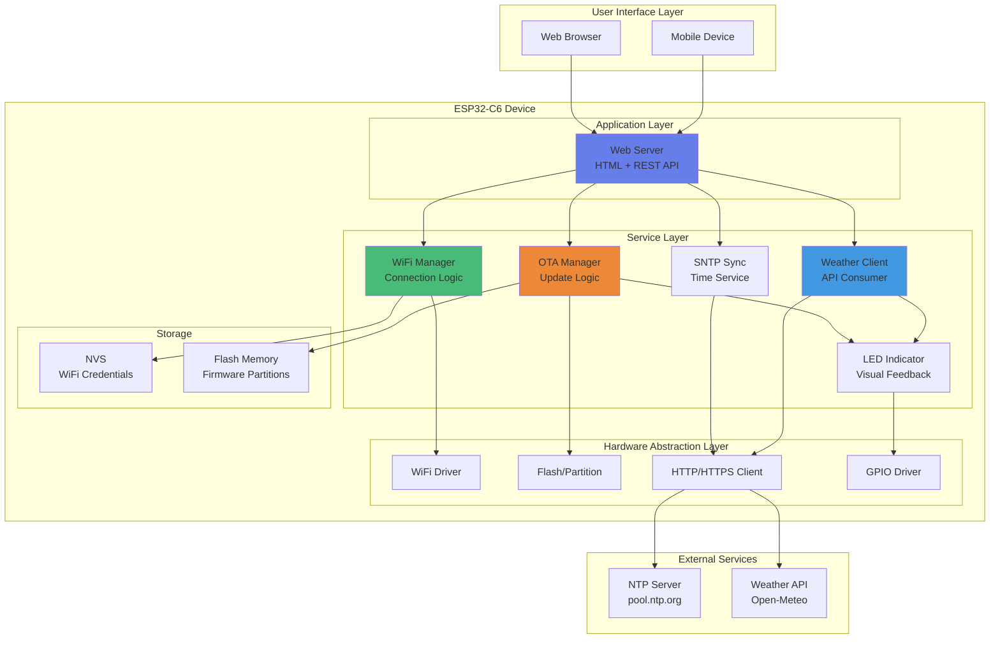
```mermaid
graph TB
    subgraph "User Interface Layer"
        Browser[Web Browser]
        Mobile[Mobile Device]
    end
    
    subgraph "ESP32-C6 Device"
        subgraph "Application Layer"
            WebServer[Web Server<br/>HTML + REST API]
        end
        
        subgraph "Service Layer"
            WiFiMgr[WiFi Manager<br/>Connection Logic]
            OTAMgr[OTA Manager<br/>Update Logic]
            SNTPSync[SNTP Sync<br/>Time Service]
            WeatherClient[Weather Client<br/>API Consumer]
            LEDInd[LED Indicator<br/>Visual Feedback]
        end
        
        subgraph "Hardware Abstraction Layer"
            WiFiDriver[WiFi Driver]
            FlashDriver[Flash/Partition]
            HTTPClient[HTTP/HTTPS Client]
            GPIODriver[GPIO Driver]
        end
        
        subgraph "Storage"
            NVS[NVS<br/>WiFi Credentials]
            Flash[Flash Memory<br/>Firmware Partitions]
        end
    end
    
    subgraph "External Services"
        NTPServer[NTP Server<br/>pool.ntp.org]
        WeatherAPI[Weather API<br/>Open-Meteo]
    end
    
    Browser --> WebServer
    Mobile --> WebServer
    
    WebServer --> WiFiMgr
    WebServer --> OTAMgr
    WebServer --> SNTPSync
    WebServer --> WeatherClient
    
    WiFiMgr --> WiFiDriver
    WiFiMgr --> NVS
    
    OTAMgr --> FlashDriver
    OTAMgr --> Flash
    OTAMgr --> LEDInd
    
    SNTPSync --> HTTPClient
    WeatherClient --> HTTPClient
    WeatherClient --> LEDInd
    
    LEDInd --> GPIODriver
    
    HTTPClient --> NTPServer
    HTTPClient --> WeatherAPI
    
    style WebServer fill:#667eea
    style WiFiMgr fill:#48bb78
    style OTAMgr fill:#ed8936
    style WeatherClient fill:#4299e1
```

### Design Principles

1. **Separation of Concerns** - Each component has a single responsibility
2. **Loose Coupling** - Components interact through well-defined interfaces
3. **High Cohesion** - Related functionality grouped together
4. **Modularity** - Easy to add/remove/replace components
5. **Testability** - Components can be tested independently

---

## Component Architecture

### 1. LED Indicator Component

**Purpose:** Hardware abstraction for LED status indication

**Responsibilities:**
- Initialize GPIO pins
- Control LED states (ON/OFF/BLINK)
- Run FreeRTOS task for blink patterns
- Provide status feedback to user

**Files:**
```
components/led_indicator/
├── include/led_indicator.h
├── led_indicator.c
└── CMakeLists.txt
```

**Key Functions:**
```c
void led_init(void);
void led_set_system_status(led_system_status_t status);
void led_set_weather_fetch(bool active);
void led_set_ap_mode(bool active);
void led_start_blink_task(void);
```

**Dependencies:**
- `esp_driver_gpio` - GPIO control
- `freertos` - Task management

---

### 2. WiFi Manager Component

**Purpose:** WiFi connection and credential management

**Responsibilities:**
- Initialize WiFi subsystem
- Handle AP mode (provisioning)
- Handle STA mode (client connection)
- Handle APSTA mode (simultaneous)
- Store/retrieve credentials from NVS
- Manage WiFi events and callbacks

**Files:**
```
components/wifi_manager/
├── include/wifi_manager.h
├── wifi_manager.c
└── CMakeLists.txt
```

**Key Functions:**
```c
esp_err_t wifi_manager_init(void);
esp_err_t wifi_manager_start_ap(void);
esp_err_t wifi_manager_start_apsta_auto(void);
esp_err_t wifi_manager_save_credentials(const char *ssid, const char *password);
bool wifi_manager_has_credentials(void);
wifi_state_t wifi_manager_get_state(void);
```

**State Machine:**
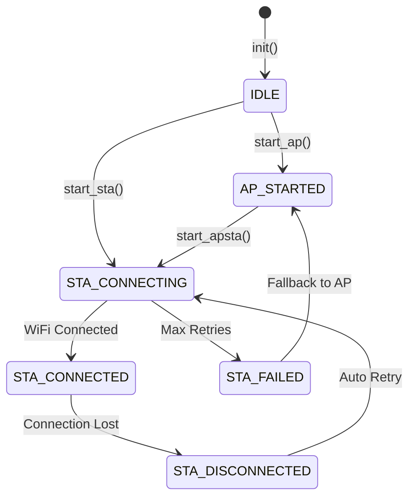
```mermaid
stateDiagram-v2
    [*] --> IDLE: init()
    IDLE --> AP_STARTED: start_ap()
    IDLE --> STA_CONNECTING: start_sta()
    AP_STARTED --> STA_CONNECTING: start_apsta()
    STA_CONNECTING --> STA_CONNECTED: WiFi Connected
    STA_CONNECTING --> STA_FAILED: Max Retries
    STA_CONNECTED --> STA_DISCONNECTED: Connection Lost
    STA_DISCONNECTED --> STA_CONNECTING: Auto Retry
    STA_FAILED --> AP_STARTED: Fallback to AP
```

**Dependencies:**
- `nvs_flash` - Credential storage
- `esp_wifi` - WiFi driver
- `esp_netif` - Network interface
- `lwip` - TCP/IP stack
- `led_indicator` - Status feedback

---

### 3. SNTP Sync Component

**Purpose:** Network time synchronization

**Responsibilities:**
- Sync with NTP servers
- Maintain system time
- Handle timezone (WIB/GMT+7)
- Provide time query interface
- Auto-retry on failure

**Files:**
```
components/sntp_sync/
├── include/sntp_sync.h
├── sntp_sync.c
└── CMakeLists.txt
```

**Key Functions:**
```c
void sntp_sync_init(void);
char* sntp_sync_get_time_str(void);
bool sntp_sync_get_time(struct tm *timeinfo);
bool sntp_sync_is_synced(void);
time_t sntp_sync_get_epoch(void);
```

**Time Sync Flow:**
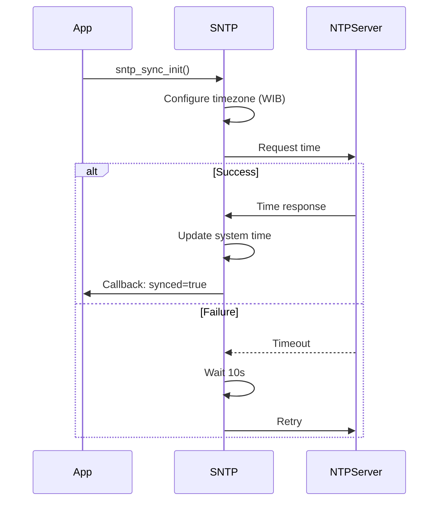
```mermaid
sequenceDiagram
    participant App
    participant SNTP
    participant NTPServer
    
    App->>SNTP: sntp_sync_init()
    SNTP->>SNTP: Configure timezone (WIB)
    SNTP->>NTPServer: Request time
    
    alt Success
        NTPServer->>SNTP: Time response
        SNTP->>SNTP: Update system time
        SNTP->>App: Callback: synced=true
    else Failure
        NTPServer-->>SNTP: Timeout
        SNTP->>SNTP: Wait 10s
        SNTP->>NTPServer: Retry
    end
```

**Dependencies:**
- `lwip` - NTP protocol implementation

---

### 4. OTA Manager Component

**Purpose:** Over-the-air firmware update management

**Responsibilities:**
- Manage OTA process
- Handle dual partition system
- Verify firmware integrity
- Perform partition switching
- Provide rollback capability

**Files:**
```
components/ota_manager/
├── include/ota_manager.h
├── ota_manager.c
└── CMakeLists.txt
```

**Key Functions:**
```c
esp_err_t ota_manager_init(void);
esp_err_t ota_manager_begin(size_t file_size);
esp_err_t ota_manager_write(const void *data, size_t size);
esp_err_t ota_manager_end(void);
void ota_manager_abort(void);
const char* ota_manager_get_version(void);
const char* ota_manager_get_partition(void);
```

**OTA Update Flow:**
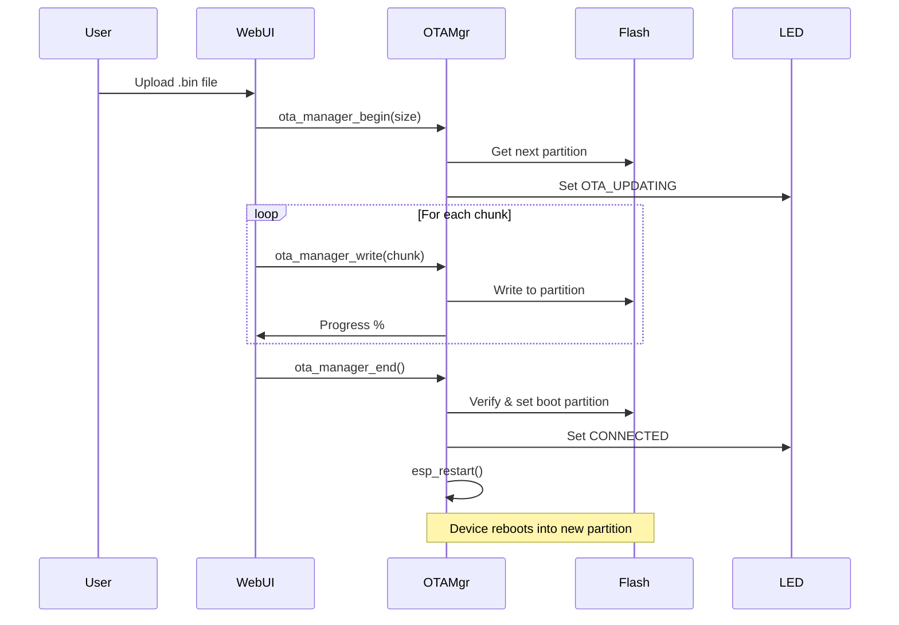
```mermaid
sequenceDiagram
    participant User
    participant WebUI
    participant OTAMgr
    participant Flash
    participant LED
    
    User->>WebUI: Upload .bin file
    WebUI->>OTAMgr: ota_manager_begin(size)
    OTAMgr->>Flash: Get next partition
    OTAMgr->>LED: Set OTA_UPDATING
    
    loop For each chunk
        WebUI->>OTAMgr: ota_manager_write(chunk)
        OTAMgr->>Flash: Write to partition
        OTAMgr->>WebUI: Progress %
    end
    
    WebUI->>OTAMgr: ota_manager_end()
    OTAMgr->>Flash: Verify & set boot partition
    OTAMgr->>LED: Set CONNECTED
    OTAMgr->>OTAMgr: esp_restart()
    
    Note over OTAMgr,Flash: Device reboots into new partition
```

**Partition Layout:**
```
┌──────────────────────────────────────────┐
│  0x00000  Bootloader (22 KB)             │
├──────────────────────────────────────────┤
│  0x08000  Partition Table (4 KB)         │
├──────────────────────────────────────────┤
│  0x09000  NVS (24 KB)                    │
├──────────────────────────────────────────┤
│  0x0F000  PHY Init (4 KB)                │
├──────────────────────────────────────────┤
│  0x10000  Factory (1.31 MB)              │ ← Recovery
│           [Recovery Firmware]            │
├──────────────────────────────────────────┤
│  0x160000 OTA_0 (1.31 MB)                │ ← Active
│           [Running Firmware]             │
├──────────────────────────────────────────┤
│  0x2B0000 OTA_1 (1.31 MB)                │ ← Standby
│           [Update Target]                │
└──────────────────────────────────────────┘
Total: 4 MB Flash
```

**Dependencies:**
- `app_update` - OTA APIs
- `led_indicator` - Status feedback

---

### 5. Weather Client Component

**Purpose:** Fetch weather data from external API

**Responsibilities:**
- HTTP/HTTPS communication
- JSON parsing
- Periodic data fetching
- Error handling and retry
- Certificate validation

**Files:**
```
components/weather_client/
├── include/weather_client.h
├── weather_client.c
└── CMakeLists.txt
```

**Key Functions:**
```c
void weather_client_init(void);
void weather_client_start(void);
bool weather_client_get_data(weather_data_t *data);
void weather_client_fetch_now(void);
```

**Weather Fetch Flow:**
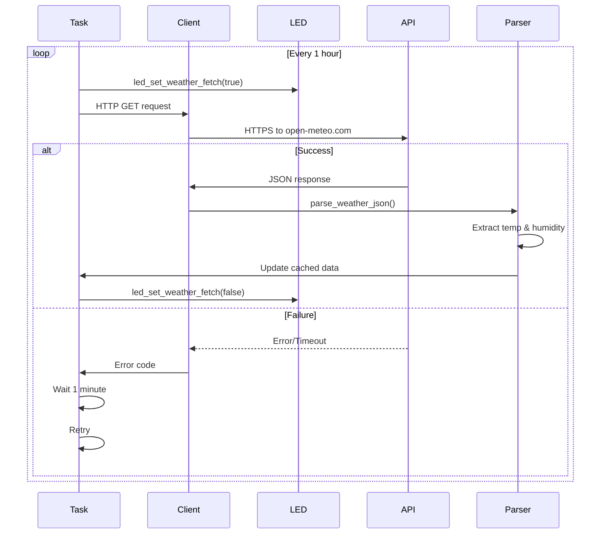
```mermaid
sequenceDiagram
    participant Task
    participant Client
    participant LED
    participant API
    participant Parser
    
    loop Every 1 hour
        Task->>LED: led_set_weather_fetch(true)
        Task->>Client: HTTP GET request
        Client->>API: HTTPS to open-meteo.com
        
        alt Success
            API->>Client: JSON response
            Client->>Parser: parse_weather_json()
            Parser->>Parser: Extract temp & humidity
            Parser->>Task: Update cached data
            Task->>LED: led_set_weather_fetch(false)
        else Failure
            API-->>Client: Error/Timeout
            Client->>Task: Error code
            Task->>Task: Wait 1 minute
            Task->>Task: Retry
        end
    end
```

**Data Structure:**
```c
typedef struct {
    float temperature;      // Celsius
    int humidity;          // Percentage
    time_t last_update;    // Unix timestamp
    bool is_valid;         // Data validity
} weather_data_t;
```

**Dependencies:**
- `esp_http_client` - HTTP/HTTPS client
- `json` - JSON parsing (cJSON)
- `esp-tls` - TLS/SSL support
- `led_indicator` - Status feedback

---

### 6. Web Server Component

**Purpose:** HTTP server and web interface

**Responsibilities:**
- Serve HTML pages
- Handle REST API requests
- Coordinate between components
- Manage HTTP sessions
- Render dynamic content

**Files:**
```
components/web_server/
├── include/web_server.h
├── web_server.c
└── CMakeLists.txt
```

**Key Functions:**
```c
esp_err_t web_server_start(void);
esp_err_t web_server_stop(void);
bool web_server_is_running(void);
```

**HTTP Handlers:**

| Endpoint | Method | Purpose |
|----------|--------|---------|
| `/` | GET | Main dashboard (HTML) |
| `/ota` | GET | OTA update page (HTML) |
| `/api/status` | GET | WiFi connection status |
| `/api/time` | GET | Current time info |
| `/api/weather` | GET | Weather data |
| `/api/wifi/save` | POST | Save WiFi credentials |
| `/api/ota/info` | GET | Firmware info |
| `/api/ota/update` | POST | Upload firmware |

**Request Flow:**
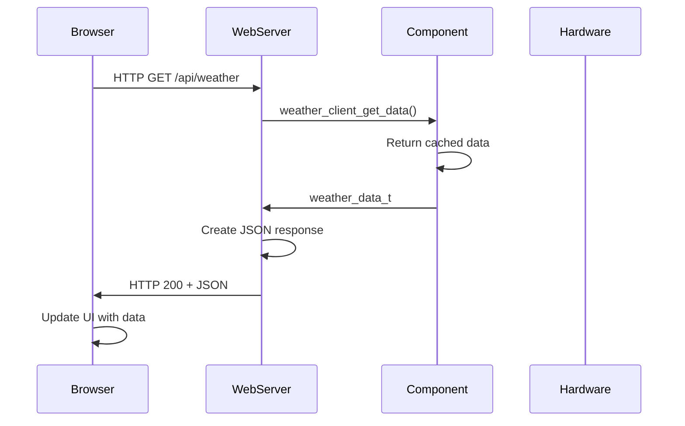
```mermaid
sequenceDiagram
    participant Browser
    participant WebServer
    participant Component
    participant Hardware
    
    Browser->>WebServer: HTTP GET /api/weather
    WebServer->>Component: weather_client_get_data()
    Component->>Component: Return cached data
    Component->>WebServer: weather_data_t
    WebServer->>WebServer: Create JSON response
    WebServer->>Browser: HTTP 200 + JSON
    
    Browser->>Browser: Update UI with data
```

**Dependencies:**
- `esp_http_server` - HTTP server
- `json` - JSON generation
- `wifi_manager` - WiFi info
- `ota_manager` - OTA operations
- `sntp_sync` - Time info
- `weather_client` - Weather data
- `led_indicator` - Status feedback

---

## Data Flow

### System Boot Flow
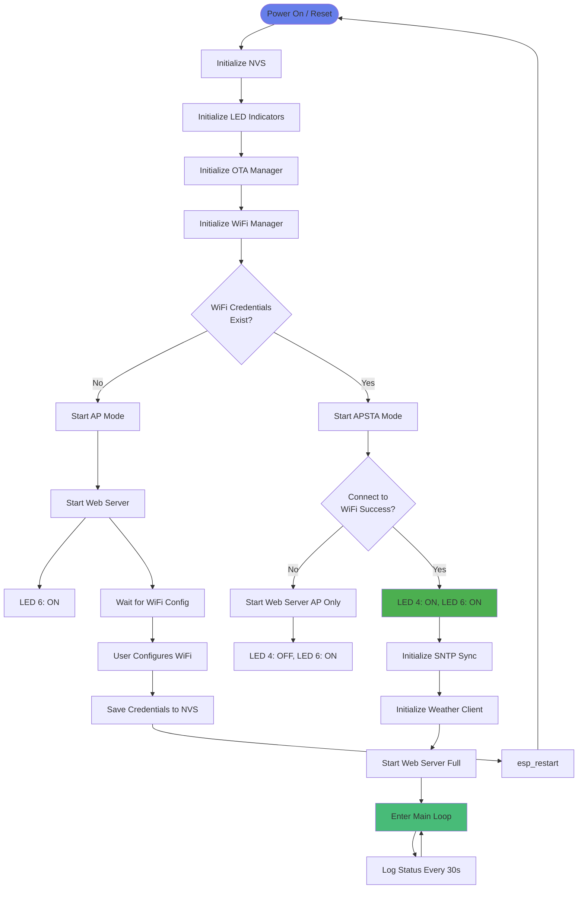
```mermaid
flowchart TD
    Start([Power On / Reset]) --> InitNVS[Initialize NVS]
    InitNVS --> InitLED[Initialize LED Indicators]
    InitLED --> InitOTA[Initialize OTA Manager]
    InitOTA --> InitWiFi[Initialize WiFi Manager]
    InitWiFi --> CheckCreds{WiFi Credentials<br/>Exist?}
    
    CheckCreds -->|No| StartAP[Start AP Mode]
    StartAP --> StartWebAP[Start Web Server]
    StartWebAP --> LED_AP[LED 6: ON]
    StartWebAP --> WaitConfig[Wait for WiFi Config]
    
    CheckCreds -->|Yes| StartAPSTA[Start APSTA Mode]
    StartAPSTA --> ConnectWiFi{Connect to<br/>WiFi Success?}
    
    ConnectWiFi -->|No| StartWebFail[Start Web Server AP Only]
    StartWebFail --> LED_Fail[LED 4: OFF, LED 6: ON]
    
    ConnectWiFi -->|Yes| LED_Connected[LED 4: ON, LED 6: ON]
    LED_Connected --> InitSNTP[Initialize SNTP Sync]
    InitSNTP --> InitWeather[Initialize Weather Client]
    InitWeather --> StartWebFull[Start Web Server Full]
    StartWebFull --> MainLoop[Enter Main Loop]
    
    WaitConfig --> UserConfig[User Configures WiFi]
    UserConfig --> SaveCreds[Save Credentials to NVS]
    SaveCreds --> Restart[esp_restart]
    Restart --> Start
    
    MainLoop --> StatusReport[Log Status Every 30s]
    StatusReport --> MainLoop
    
    style Start fill:#667eea
    style MainLoop fill:#48bb78
    style LED_Connected fill:#4CAF50
```

### WiFi Connection Flow
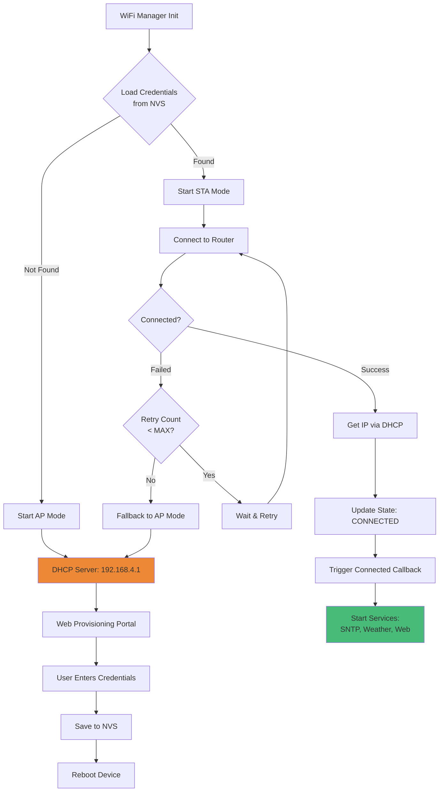
```mermaid
flowchart TD
    Init[WiFi Manager Init] --> LoadCreds{Load Credentials<br/>from NVS}
    
    LoadCreds -->|Not Found| AP_Mode[Start AP Mode]
    AP_Mode --> AP_Server[DHCP Server: 192.168.4.1]
    AP_Server --> WebPortal[Web Provisioning Portal]
    WebPortal --> UserInput[User Enters Credentials]
    UserInput --> SaveNVS[Save to NVS]
    SaveNVS --> Reboot[Reboot Device]
    
    LoadCreds -->|Found| STA_Mode[Start STA Mode]
    STA_Mode --> Connect[Connect to Router]
    Connect --> ConnectResult{Connected?}
    
    ConnectResult -->|Success| GetIP[Get IP via DHCP]
    GetIP --> StoreState[Update State: CONNECTED]
    StoreState --> Callback[Trigger Connected Callback]
    Callback --> Services[Start Services:<br/>SNTP, Weather, Web]
    
    ConnectResult -->|Failed| RetryCheck{Retry Count<br/>< MAX?}
    RetryCheck -->|Yes| Retry[Wait & Retry]
    Retry --> Connect
    
    RetryCheck -->|No| FallbackAP[Fallback to AP Mode]
    FallbackAP --> AP_Server
    
    style Services fill:#48bb78
    style AP_Server fill:#ed8936
```

### Weather Data Flow
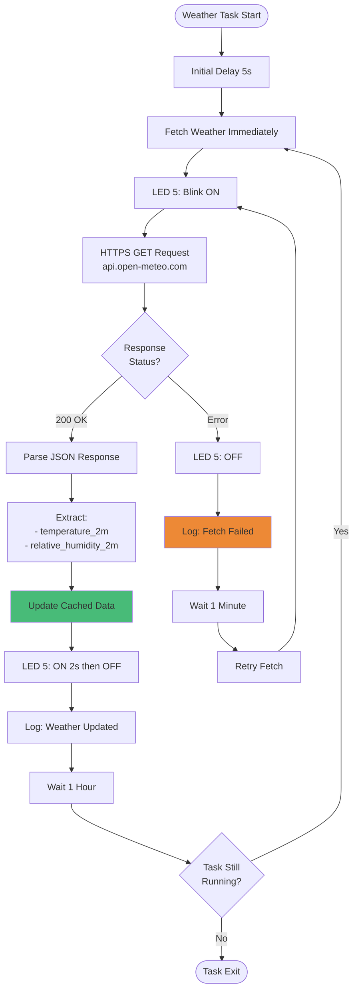
```mermaid
flowchart TD
    Start([Weather Task Start]) --> InitDelay[Initial Delay 5s]
    InitDelay --> FetchNow[Fetch Weather Immediately]
    
    FetchNow --> LED_On[LED 5: Blink ON]
    LED_On --> HTTPReq[HTTPS GET Request<br/>api.open-meteo.com]
    
    HTTPReq --> CheckResp{Response<br/>Status?}
    
    CheckResp -->|200 OK| ParseJSON[Parse JSON Response]
    ParseJSON --> ExtractData[Extract:<br/>- temperature_2m<br/>- relative_humidity_2m]
    ExtractData --> UpdateCache[Update Cached Data]
    UpdateCache --> LED_Success[LED 5: ON 2s then OFF]
    LED_Success --> LogSuccess[Log: Weather Updated]
    LogSuccess --> Wait1H[Wait 1 Hour]
    
    CheckResp -->|Error| LED_Off[LED 5: OFF]
    LED_Off --> LogError[Log: Fetch Failed]
    LogError --> Wait1M[Wait 1 Minute]
    Wait1M --> Retry[Retry Fetch]
    Retry --> LED_On
    
    Wait1H --> CheckRunning{Task Still<br/>Running?}
    CheckRunning -->|Yes| FetchNow
    CheckRunning -->|No| End([Task Exit])
    
    style UpdateCache fill:#48bb78
    style LogError fill:#ed8936
```

### OTA Update Flow
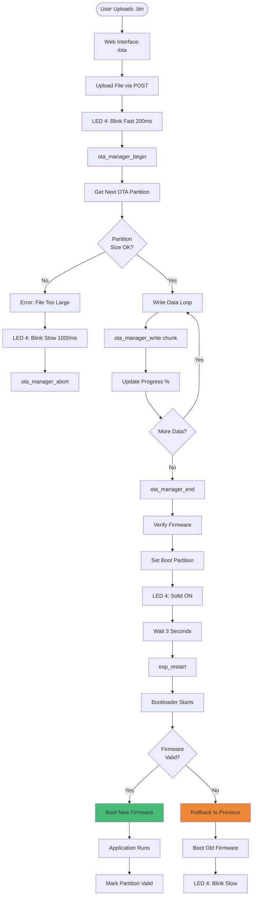
```mermaid
flowchart TD
    Start([User Uploads .bin]) --> WebUI[Web Interface:<br/>/ota]
    WebUI --> Upload[Upload File via POST]
    Upload --> LED_OTA[LED 4: Blink Fast 200ms]
    LED_OTA --> Begin[ota_manager_begin]
    
    Begin --> GetPartition[Get Next OTA Partition]
    GetPartition --> CheckSpace{Partition<br/>Size OK?}
    
    CheckSpace -->|No| ErrorSize[Error: File Too Large]
    ErrorSize --> LED_Error[LED 4: Blink Slow 1000ms]
    LED_Error --> AbortOTA[ota_manager_abort]
    
    CheckSpace -->|Yes| WriteLoop[Write Data Loop]
    WriteLoop --> WriteChunk[ota_manager_write chunk]
    WriteChunk --> Progress[Update Progress %]
    Progress --> MoreChunks{More Data?}
    
    MoreChunks -->|Yes| WriteLoop
    MoreChunks -->|No| EndOTA[ota_manager_end]
    
    EndOTA --> Verify[Verify Firmware]
    Verify --> SetBoot[Set Boot Partition]
    SetBoot --> LED_Done[LED 4: Solid ON]
    LED_Done --> Countdown[Wait 3 Seconds]
    Countdown --> Restart[esp_restart]
    
    Restart --> Bootloader[Bootloader Starts]
    Bootloader --> ValidateFW{Firmware<br/>Valid?}
    
    ValidateFW -->|Yes| BootNew[Boot New Firmware]
    BootNew --> RunNew[Application Runs]
    RunNew --> MarkValid[Mark Partition Valid]
    
    ValidateFW -->|No| Rollback[Rollback to Previous]
    Rollback --> BootOld[Boot Old Firmware]
    BootOld --> LED_Recovery[LED 4: Blink Slow]
    
    style BootNew fill:#48bb78
    style Rollback fill:#ed8936
```

---

## Sequence Diagrams

### First Boot Sequence
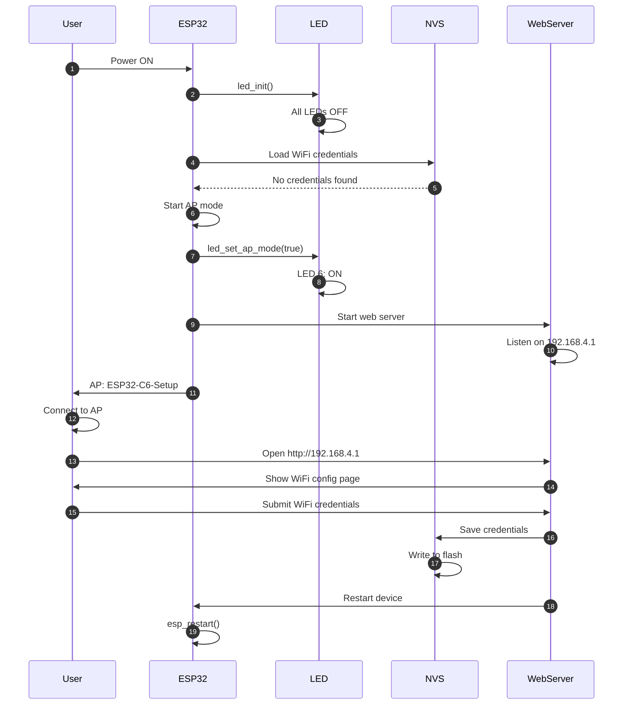
```mermaid
sequenceDiagram
    autonumber
    participant User
    participant ESP32
    participant LED
    participant NVS
    participant WebServer
    
    User->>ESP32: Power ON
    ESP32->>LED: led_init()
    LED->>LED: All LEDs OFF
    
    ESP32->>NVS: Load WiFi credentials
    NVS-->>ESP32: No credentials found
    
    ESP32->>ESP32: Start AP mode
    ESP32->>LED: led_set_ap_mode(true)
    LED->>LED: LED 6: ON
    
    ESP32->>WebServer: Start web server
    WebServer->>WebServer: Listen on 192.168.4.1
    
    ESP32->>User: AP: ESP32-C6-Setup
    User->>User: Connect to AP
    User->>WebServer: Open http://192.168.4.1
    WebServer->>User: Show WiFi config page
    
    User->>WebServer: Submit WiFi credentials
    WebServer->>NVS: Save credentials
    NVS->>NVS: Write to flash
    
    WebServer->>ESP32: Restart device
    ESP32->>ESP32: esp_restart()
```

### Normal Operation Sequence
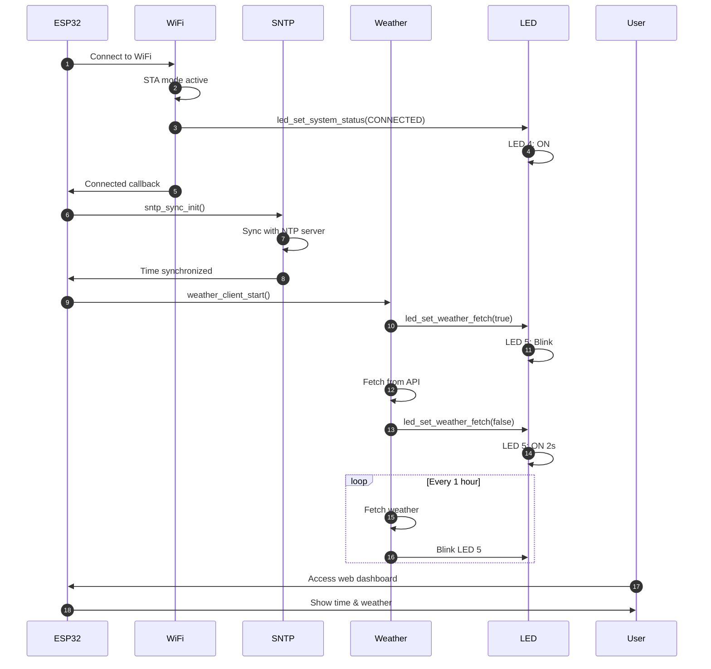
```mermaid
sequenceDiagram
    autonumber
    participant ESP32
    participant WiFi
    participant SNTP
    participant Weather
    participant LED
    participant User
    
    ESP32->>WiFi: Connect to WiFi
    WiFi->>WiFi: STA mode active
    WiFi->>LED: led_set_system_status(CONNECTED)
    LED->>LED: LED 4: ON
    
    WiFi->>ESP32: Connected callback
    ESP32->>SNTP: sntp_sync_init()
    SNTP->>SNTP: Sync with NTP server
    SNTP->>ESP32: Time synchronized
    
    ESP32->>Weather: weather_client_start()
    Weather->>LED: led_set_weather_fetch(true)
    LED->>LED: LED 5: Blink
    
    Weather->>Weather: Fetch from API
    Weather->>LED: led_set_weather_fetch(false)
    LED->>LED: LED 5: ON 2s
    
    loop Every 1 hour
        Weather->>Weather: Fetch weather
        Weather->>LED: Blink LED 5
    end
    
    User->>ESP32: Access web dashboard
    ESP32->>User: Show time & weather
```

### OTA Update Sequence
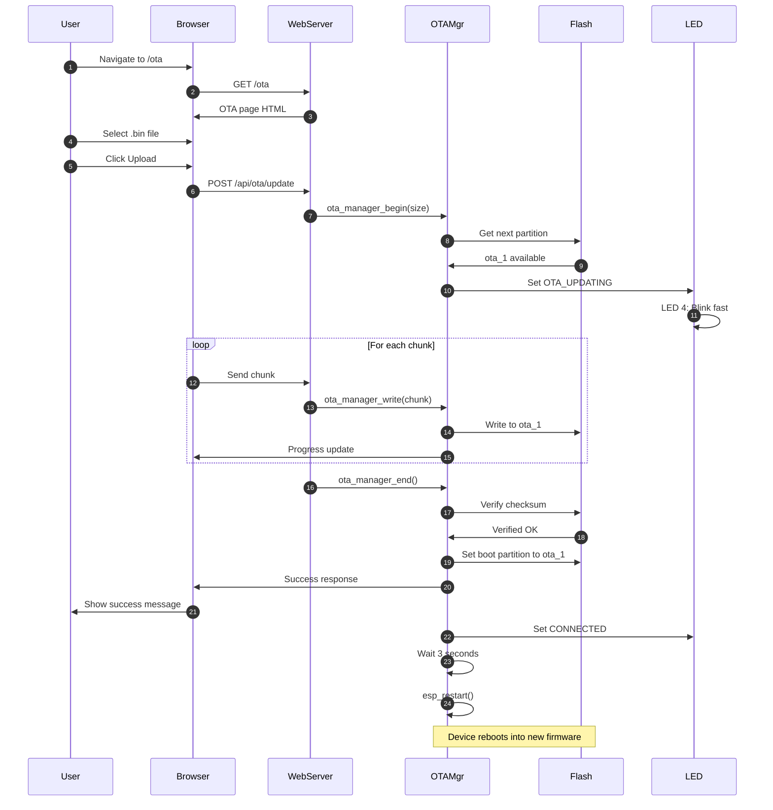
```mermaid
sequenceDiagram
    autonumber
    participant User
    participant Browser
    participant WebServer
    participant OTAMgr
    participant Flash
    participant LED
    
    User->>Browser: Navigate to /ota
    Browser->>WebServer: GET /ota
    WebServer->>Browser: OTA page HTML
    
    User->>Browser: Select .bin file
    User->>Browser: Click Upload
    Browser->>WebServer: POST /api/ota/update
    
    WebServer->>OTAMgr: ota_manager_begin(size)
    OTAMgr->>Flash: Get next partition
    Flash->>OTAMgr: ota_1 available
    
    OTAMgr->>LED: Set OTA_UPDATING
    LED->>LED: LED 4: Blink fast
    
    loop For each chunk
        Browser->>WebServer: Send chunk
        WebServer->>OTAMgr: ota_manager_write(chunk)
        OTAMgr->>Flash: Write to ota_1
        OTAMgr->>Browser: Progress update
    end
    
    WebServer->>OTAMgr: ota_manager_end()
    OTAMgr->>Flash: Verify checksum
    Flash->>OTAMgr: Verified OK
    
    OTAMgr->>Flash: Set boot partition to ota_1
    OTAMgr->>Browser: Success response
    Browser->>User: Show success message
    
    OTAMgr->>LED: Set CONNECTED
    OTAMgr->>OTAMgr: Wait 3 seconds
    OTAMgr->>OTAMgr: esp_restart()
    
    Note over OTAMgr,Flash: Device reboots into new firmware
```

---

## Memory Layout

### Flash Memory Map (4 MB)
```
Address     Size        Name          Type        Purpose
────────────────────────────────────────────────────────────
0x000000    ~22 KB      Bootloader    System      Second stage bootloader
0x008000    4 KB        PartTable     System      Partition table
0x009000    24 KB       NVS           Data        Non-volatile storage
0x00F000    4 KB        PHY_Init      Data        RF calibration data
0x010000    1.31 MB     Factory       App         Recovery firmware
0x160000    1.31 MB     OTA_0         App         Active partition 1
0x2B0000    1.31 MB     OTA_1         App         Active partition 2
0x400000    (End)       -             -           4 MB boundary
```

### RAM Usage

**Static Memory Allocation:**
```
Component          Size        Purpose
──────────────────────────────────────────────
System             ~80 KB      ESP-IDF core
WiFi Stack         ~40 KB      WiFi driver
TCP/IP Stack       ~25 KB      LwIP
HTTP Server        ~15 KB      Server + connections
Application        ~20 KB      Custom components
──────────────────────────────────────────────
Total (approx)     ~180 KB
```

**Heap Memory:**
```
Free heap at boot:  ~220 KB
After WiFi init:    ~180 KB
During OTA:         ~150 KB (temporary)
Normal operation:   ~170 KB
```

---

## Communication Protocols

### 1. HTTP/HTTPS Protocol

**Web Server:**
- Protocol: HTTP/1.1
- Port: 80
- Max connections: 4 simultaneous
- Request timeout: 30 seconds
- Buffer size: 4096 bytes

**HTTPS Client (Weather API):**
- Protocol: HTTPS (TLS 1.2+)
- Certificate validation: CA bundle
- Timeout: 10 seconds
- Buffer size: 2048 bytes

### 2. WiFi Protocol

**AP Mode:**
- Standard: IEEE 802.11 b/g/n
- Frequency: 2.4 GHz
- Channel: 1 (configurable)
- Security: WPA2-PSK
- IP: 192.168.4.1/24
- DHCP server: Enabled

**STA Mode:**
- Standard: IEEE 802.11 b/g/n
- Frequency: 2.4 GHz
- Security: WPA/WPA2/WPA3
- DHCP client: Enabled
- Auto-reconnect: Yes

**APSTA Mode:**
- AP + STA simultaneously
- Separate IP interfaces
- Independent operation

### 3. NTP Protocol

- Protocol: NTP (Network Time Protocol)
- Server: pool.ntp.org
- Port: 123 (UDP)
- Sync interval: On boot + periodic
- Timezone: WIB (GMT+7)

### 4. JSON Data Format

**Weather API Response:**
```json
{
  "current": {
    "time": "2026-02-16T23:30",
    "temperature_2m": 26.4,
    "relative_humidity_2m": 91
  }
}
```

**Internal Weather Data:**
```json
{
  "valid": true,
  "temperature": 26.4,
  "humidity": 91,
  "last_update": 1771259073,
  "last_update_str": "16.02.2026 23:34:33"
}
```

---

## State Machine

### System State Diagram
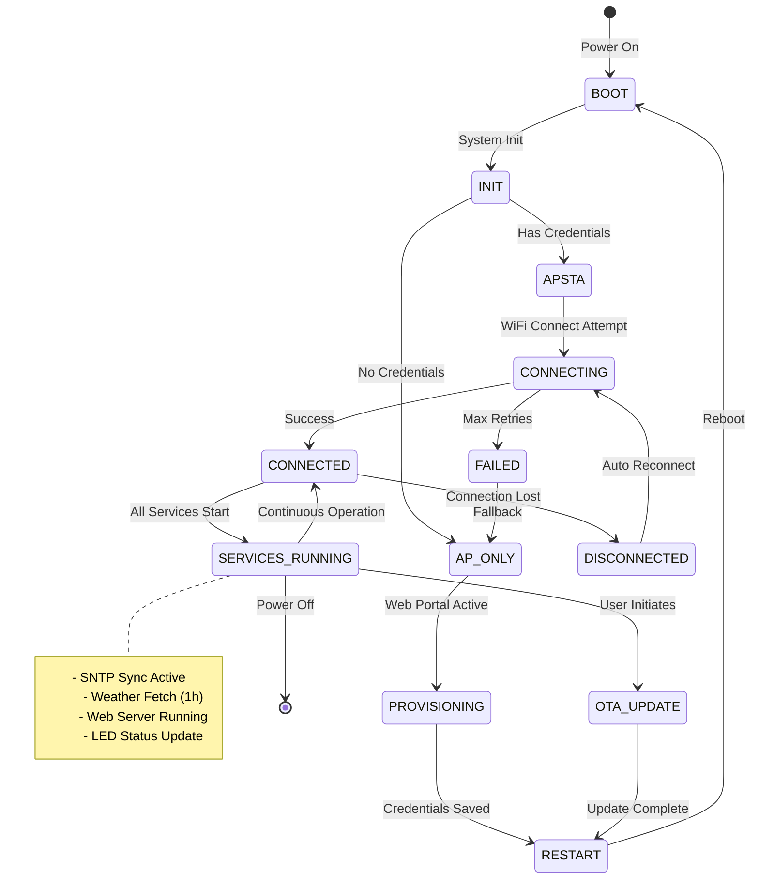
```mermaid
stateDiagram-v2
    [*] --> BOOT: Power On
    
    BOOT --> INIT: System Init
    
    INIT --> AP_ONLY: No Credentials
    INIT --> APSTA: Has Credentials
    
    AP_ONLY --> PROVISIONING: Web Portal Active
    PROVISIONING --> RESTART: Credentials Saved
    
    APSTA --> CONNECTING: WiFi Connect Attempt
    CONNECTING --> CONNECTED: Success
    CONNECTING --> FAILED: Max Retries
    
    CONNECTED --> SERVICES_RUNNING: All Services Start
    SERVICES_RUNNING --> CONNECTED: Continuous Operation
    
    CONNECTED --> DISCONNECTED: Connection Lost
    DISCONNECTED --> CONNECTING: Auto Reconnect
    
    FAILED --> AP_ONLY: Fallback
    
    SERVICES_RUNNING --> OTA_UPDATE: User Initiates
    OTA_UPDATE --> RESTART: Update Complete
    
    RESTART --> BOOT: Reboot
    
    SERVICES_RUNNING --> [*]: Power Off
    
    note right of SERVICES_RUNNING
        - SNTP Sync Active
        - Weather Fetch (1h)
        - Web Server Running
        - LED Status Update
    end note
```

### LED State Machine
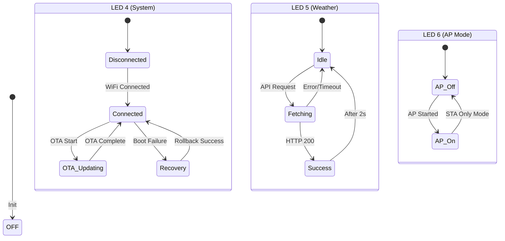
```mermaid
stateDiagram-v2
    [*] --> OFF: Init
    
    state "LED 4 (System)" as LED4 {
        [*] --> Disconnected
        Disconnected --> Connected: WiFi Connected
        Connected --> OTA_Updating: OTA Start
        OTA_Updating --> Connected: OTA Complete
        Connected --> Recovery: Boot Failure
        Recovery --> Connected: Rollback Success
    }
    
    state "LED 5 (Weather)" as LED5 {
        [*] --> Idle
        Idle --> Fetching: API Request
        Fetching --> Success: HTTP 200
        Success --> Idle: After 2s
        Fetching --> Idle: Error/Timeout
    }
    
    state "LED 6 (AP Mode)" as LED6 {
        [*] --> AP_Off
        AP_Off --> AP_On: AP Started
        AP_On --> AP_Off: STA Only Mode
    }
```

---

## Security Architecture

### 1. Network Security

**WiFi Security:**
- WPA2-PSK for AP mode
- Support for WPA/WPA2/WPA3 in STA mode
- Credentials stored encrypted in NVS
- No default passwords in production

**HTTPS/TLS:**
- TLS 1.2+ for weather API
- Certificate bundle validation
- No self-signed certificates accepted
- Secure connection required for sensitive data

### 2. OTA Security

**Firmware Validation:**
- Checksum verification (MD5)
- Signature validation (optional, can be added)
- Rollback protection
- Secure boot support (hardware feature)

**Update Process:**
- Only authenticated uploads
- Partition isolation
- Atomic updates (all-or-nothing)
- Factory partition as recovery

### 3. Data Protection

**NVS Encryption:**
- WiFi credentials encrypted at rest
- Flash encryption support (hardware)
- Secure erase on factory reset

**Memory Protection:**
- No sensitive data in logs
- Credentials never transmitted in clear text
- Heap overflow protection

### 4. Attack Surface

**Mitigations:**
- No telnet/SSH (only HTTP/HTTPS)
- Limited API endpoints
- Input validation on all forms
- Rate limiting (can be added)
- CORS headers (can be added)

---

## Performance Characteristics

### 1. Boot Time
```
Stage                    Duration
────────────────────────────────────
Bootloader               ~50 ms
Application init         ~200 ms
WiFi connection          ~2-5 s
SNTP sync               ~1-3 s
Services ready          ~5-10 s
────────────────────────────────────
Total boot time:        5-10 seconds
```

### 2. Response Times
```
Operation               Typical     Max
─────────────────────────────────────────
Web page load           200 ms      500 ms
API request             50 ms       200 ms
Weather fetch           2 s         5 s
OTA upload (1 MB)       30 s        60 s
WiFi reconnect          3 s         15 s
```

### 3. Resource Usage

**CPU:**
- Idle: ~5%
- Weather fetch: ~30% (during request)
- OTA update: ~40%
- Web serving: ~20% per connection

**Network Bandwidth:**
- Weather API: ~2 KB/hour
- Web dashboard: ~50 KB/load
- OTA update: 1.1 MB (one-time)

**Power Consumption:**
- Active (WiFi on): ~160 mA @ 3.3V
- During weather fetch: ~180 mA
- During OTA: ~200 mA
- Deep sleep (not implemented): ~10 µA

### 4. Scalability

**Concurrent Users:**
- Max HTTP connections: 4
- Recommended: 1-2 simultaneous users
- API rate limit: None (can be added)

**Data Storage:**
- NVS usage: ~1 KB
- No persistent weather history (can be added)
- Firmware size: ~1.08 MB

---

## Design Patterns Used

### 1. Component Pattern
Each functionality is a separate component with clear interface

### 2. Callback Pattern
WiFi manager uses callbacks for connection events

### 3. Singleton Pattern
Web server, OTA manager operate as singletons

### 4. Observer Pattern
LED indicators observe system state changes

### 5. Facade Pattern
Web server provides unified interface to all components

### 6. State Pattern
WiFi manager implements explicit state machine

---

## Future Enhancements

### Planned Features

1. **Data Logging**
   - Store weather history in SPIFFS
   - Export data as CSV/JSON
   - Chart visualization

2. **User Configuration**
   - Customizable weather location
   - Adjustable fetch intervals
   - Temperature unit selection (°C/°F)

3. **Alert System**
   - Temperature threshold alerts
   - Email/Telegram notifications
   - Custom alert rules

4. **MQTT Integration**
   - Publish weather data to MQTT broker
   - Subscribe to control commands
   - Home automation integration

5. **Power Management**
   - Deep sleep mode
   - Battery monitoring
   - Solar panel support

6. **Advanced OTA**
   - Firmware signing
   - Delta updates (reduce bandwidth)
   - A/B testing support

---

## References

- [ESP-IDF Programming Guide](https://docs.espressif.com/projects/esp-idf/en/latest/esp32c6/)
- [ESP32-C6 Technical Reference Manual](https://www.espressif.com/sites/default/files/documentation/esp32-c6_technical_reference_manual_en.pdf)
- [Open-Meteo API Documentation](https://open-meteo.com/en/docs)
- [FreeRTOS Documentation](https://www.freertos.org/Documentation/RTOS_book.html)

---

**Document Version:** 1.0  
**Last Updated:** 2026-02-16  
**Maintained By:** MJ